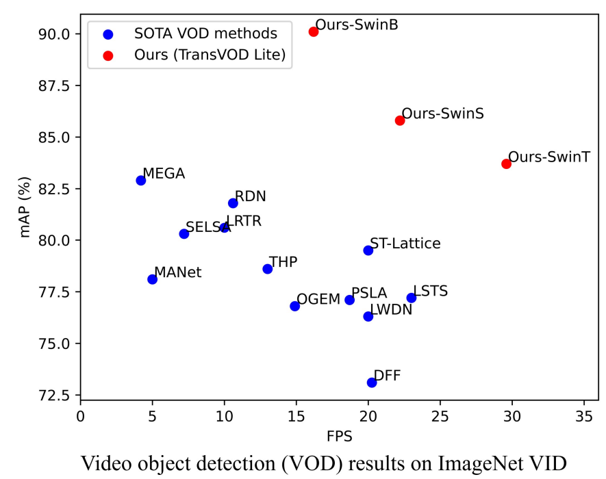
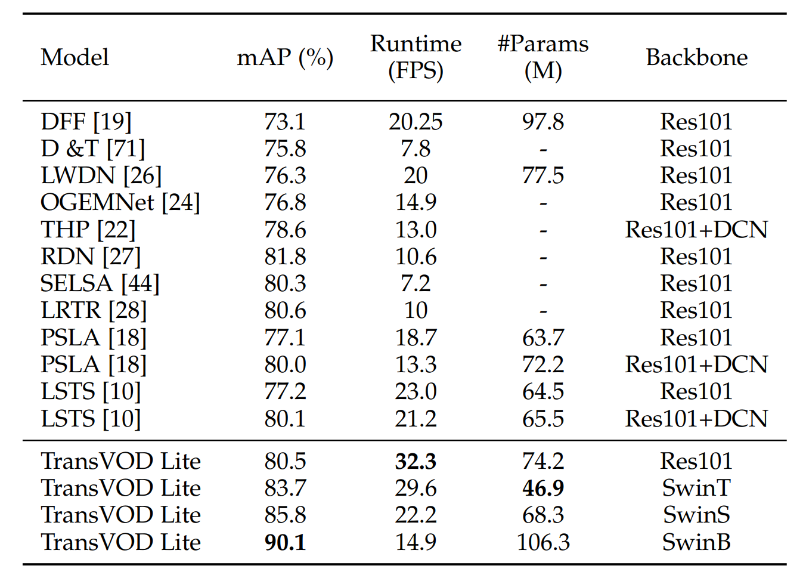

# TransVOD_Lite
**by [Qianyu Zhou](https://lhoyer.github.io/), [Xiangtai Li](https://vas.mpi-inf.mpg.de/dengxin/), [Lu He](https://scholar.google.de/citations?user=TwMib_QAAAAJ&hl=en)**, 

**[[Arxiv]](https://arxiv.org/pdf/2201.05047.pdf)**
**[[Paper]](https://ieeexplore.ieee.org/document/9960850)**


[](https://paperswithcode.com/sota/video-object-detection-on-imagenet-vid?p=transvod-end-to-end-video-object-detection)

This repository is an official implementation of the paper TransVOD:End-to-End Video Object Detection with Spatial-Temporal Transformers(https://ieeexplore.ieee.org/document/9960850), espeically the code of TransVOD Lite.

:bell: We are happy to announce that TransVOD was accepted at **IEEE TPAMI**. 

:bell: We are happy to announce that our method is the first work that achieves 90% mAP on ImageNet VID dataset.. :bell:


## Updates
- (December 2022) Code and pretrained weights of TransVOD Lite released. 

## Citing TransVOD
If you find TransVOD useful in your research, please consider citing:
```bibtex
@article{zhou2022transvod,
 author={Zhou, Qianyu and Li, Xiangtai and He, Lu and Yang, Yibo and Cheng, Guangliang and Tong, Yunhai and Ma, Lizhuang and Tao, Dacheng},  journal={IEEE Transactions on Pattern Analysis and Machine Intelligence},   
 title={TransVOD: End-to-End Video Object Detection With Spatial-Temporal Transformers},   
 year={2022},   
 pages={1-16},  
 doi={10.1109/TPAMI.2022.3223955}}


@inproceedings{he2021end,
  title={End-to-End Video Object Detection with Spatial-Temporal Transformers},
  author={He, Lu and Zhou, Qianyu and Li, Xiangtai and Niu, Li and Cheng, Guangliang and Li, Xiao and Liu, Wenxuan and Tong, Yunhai and Ma, Lizhuang and Zhang, Liqing},
  booktitle={Proceedings of the 29th ACM International Conference on Multimedia},
  pages={1507--1516},
  year={2021}
}
```


## Main Results
Speed and Accuracy trade-off of video object detection (VOD) results in ImageNet VID dataset. The blue points plot the state-of-the-art (SOTA) VOD methods, and the red ones are our proposed method TransVOD Lite, achieving the best tradeoff between the speed and accuracy with different backbones. SwinB, SwinS and SwinT mean Swin Base, Small and Tiny.





*Note:*
1. All models of TransVOD are trained  with pre-trained weights on COCO dataset.


## Installation

The codebase is built on top of [Deformable DETR](https://github.com/fundamentalvision/Deformable-DETR) and [TransVOD](https://github.com/SJTU-LuHe/TransVOD).

### Requirements

* Linux, CUDA>=9.2, GCC>=5.4
  
* Python>=3.7

    We recommend you to use Anaconda to create a conda environment:
    ```bash
    conda create -n TransVOD python=3.7 pip
    ```
    Then, activate the environment:
    ```bash
    conda activate TransVOD
    ```
  
* PyTorch>=1.5.1, torchvision>=0.6.1 (following instructions [here](https://pytorch.org/)

    For example, if your CUDA version is 9.2, you could install pytorch and torchvision as following:
    ```bash
    conda install pytorch=1.5.1 torchvision=0.6.1 cudatoolkit=9.2 -c pytorch
    ```
  
* Other requirements
    ```bash
    pip install -r requirements.txt
    ```

* Build MultiScaleDeformableAttention
    ```bash
    cd ./models/ops
    sh ./make.sh
    ```

## Usage

### Dataset preparation

1. Please download ILSVRC2015 DET and ILSVRC2015 VID dataset from [here](https://image-net.org/challenges/LSVRC/2015/2015-downloads). Then we covert jsons of two datasets by using the [code](https://github.com/open-mmlab/mmtracking/blob/master/tools/convert_datasets/ilsvrc/). The joint [json](https://drive.google.com/drive/folders/1cCXY41IFsLT-P06xlPAGptG7sc-zmGKF?usp=sharing)  of two datasets is provided. The  After that, we recommend to symlink the path to the datasets to datasets/. And the path structure should be as follows:

```
code_root/
└── data/
    └── vid/
        ├── Data
            ├── VID/
            └── DET/
        └── annotations/
        	  ├── imagenet_vid_train.json
            ├── imagenet_vid_train_joint_30.json
        	  └── imagenet_vid_val.json

```

### Training
We use Swin Transformer as the network backbone. We train our TransVOD with Swin-base as backbone as following:

#### Training on single node
1. Train SingleBaseline. You can download COCO pretrained weights from this [link](https://github.com/fundamentalvision/Deformable-DETR). 
   
```bash 
GPUS_PER_NODE=8 ./tools/run_dist_launch.sh $1 r50 $2 configs/swinb_train_single.sh
```  
1. Train TransVOD. Using the model weights of SingleBaseline as the resume model.

```bash 
GPUS_PER_NODE=8 ./tools/run_dist_launch.sh $1 r50 $2 configs/swinb_train_multi.sh
``` 


#### Training on slurm cluster
If you are using slurm cluster, you can simply run the following command to train on 1 node with 8 GPUs:
```bash
GPUS_PER_NODE=8 ./tools/run_dist_slurm.sh <partition> r50 8 configs/swinb_train_multi.sh
```

### Evaluation
You can get the config file and pretrained model of TransVOD (the link is in "Main Results" session), then put the pretrained_model into correponding folder.
```
code_root/
└── exps/
    └── our_models/
        ├── COCO_pretrained_model
        ├── exps_single
        └── exps_multi
```
And then run following command to evaluate it on ImageNET VID validation set:
```bash 
GPUS_PER_NODE=8 ./tools/run_dist_launch.sh $1 eval_r50 $2 configs/r50_eval_multi.sh
```

## Acknowledgements

This project is based on the following open-source projects. We thank their
authors for making the source code publically available.

* [Deformable DETR](https://github.com/fundamentalvision/Deformable-DETR)


## License

This project is released under the [Apache License 2.0](LICENSE), while some 
specific features in this repository are with other licenses. Please refer to 
[LICENSES.md](LICENSES.md) for the careful check, if you are using our code for 
commercial matters.


